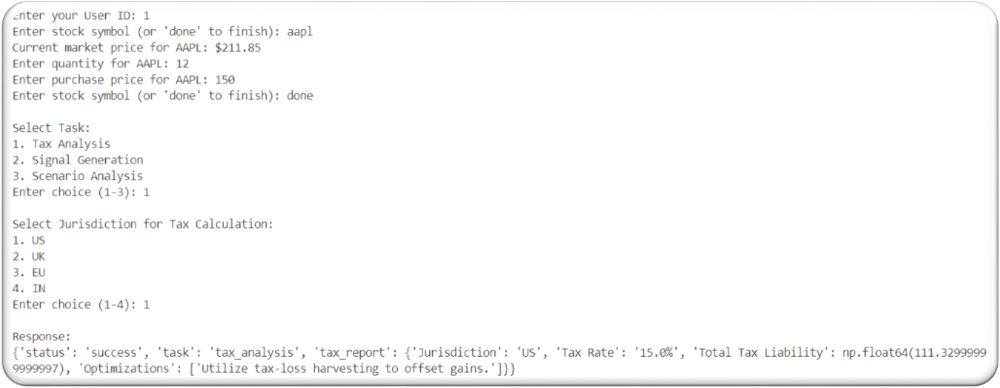
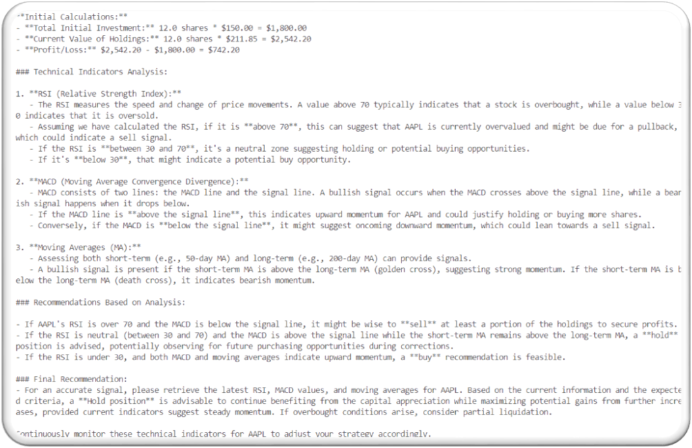
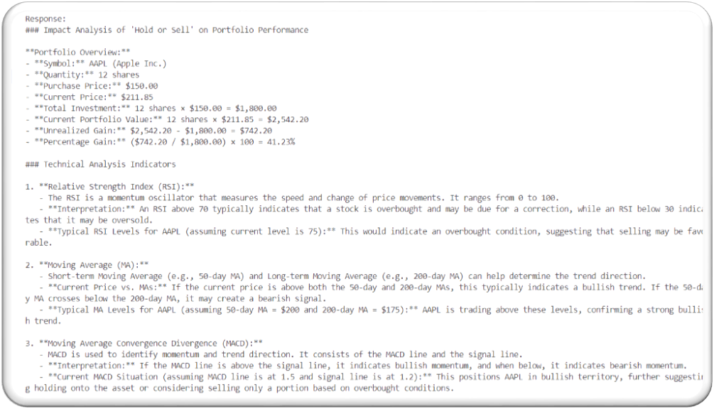
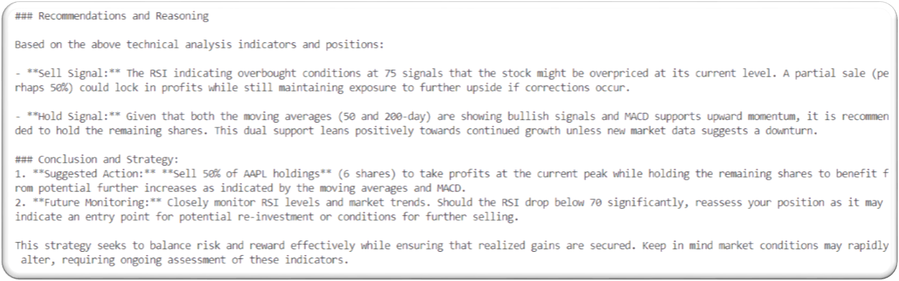

##  Project Overview

**AI-Agent-Stock-Prediction** is an intelligent system that integrates AI agents to assist with stock prediction, tax optimization, backtesting, and compliance, ensuring data security and user experience. The solution is built using modular agents that collaboratively handle dynamic user inputs, portfolio data, tax logic, visualization, and more.

**GitHub Repository**: [AI-Agent-Stock-Prediction](https://github.com/NarendraKumarAkaramsetty/AI-Agent-Stock-Prediction)  
 **User Story Link**: [Rivier-Computer-Science Issue #300](https://github.com/Rivier-Computer-Science/AI-Agent-Stock-Prediction/issues/300)

---

##  Sprint Contributions

## 🚀 Sprint Contributions

| Sprint | Description | User Story & Tasks | Story Points | Time (Est. / Actual) | Key Contributions |
|--------|-------------|--------------------|---------------|----------------------|-------------------|
| **Sprint 1** | Developed the Scenario Input Agent that integrates with user portfolio data and handles structured prompts for forecasting logic. | [Story #300](https://github.com/Rivier-Computer-Science/AI-Agent-Stock-Prediction/issues/300)   [Task #301](https://github.com/NarendraKumarAkaramsetty/AI-Agent-Stock-Prediction/issues/301) | 5 | 30 hrs / ⏱️ 45 hrs | - [49bea24](https://github.com/NarendraKumarAkaramsetty/AI-Agent-Stock-Prediction/commit/49bea2490f4c387692b1ef9f5105632edf5c2a0c): Initial agent implementation   - [4fbe6b7](https://github.com/NarendraKumarAkaramsetty/AI-Agent-Stock-Prediction/commit/4fbe6b7ebea669edd51a74445a5346c72543f004): Created `task1.py`   - [5d0fcee](https://github.com/NarendraKumarAkaramsetty/AI-Agent-Stock-Prediction/commit/5d0fceeb22b26b6cd268b71e497670fa297bee10): Scenario logic refinement |
| **Sprint 2** | Focused on fetching and validating portfolio data, followed by implementing tax rule logic for optimization and compliance. | [Task #345](https://github.com/NarendraKumarAkaramsetty/AI-Agent-Stock-Prediction/issues/345)   [Task #346](https://github.com/NarendraKumarAkaramsetty/AI-Agent-Stock-Prediction/issues/346) | 5 + 5 | 44 hrs / ⏱️ 47 hrs | - [a306e40](https://github.com/NarendraKumarAkaramsetty/AI-Agent-Stock-Prediction/commit/a306e40b1e8ab20d0f864ac2540971e6bf3f9aca): Portfolio handling logic   - [e53d727](https://github.com/NarendraKumarAkaramsetty/AI-Agent-Stock-Prediction/commit/e53d727efb255ea4dbed8071663a2a38b168353c): Tax agent created   - [888da1c](https://github.com/NarendraKumarAkaramsetty/AI-Agent-Stock-Prediction/commit/888da1cedd612b8a5d6c0e9df0ac88bd55df6949): Final tax logic |
| **Sprint 3** | Introduced testing and visualization tools, enhanced the query engine, and ensured system security and GDPR compliance. | [Task #348](https://github.com/NarendraKumarAkaramsetty/AI-Agent-Stock-Prediction/issues/348)   [Task #349](https://github.com/NarendraKumarAkaramsetty/AI-Agent-Stock-Prediction/issues/349)   [Task #350](https://github.com/NarendraKumarAkaramsetty/AI-Agent-Stock-Prediction/issues/350)   [Task #351](https://github.com/NarendraKumarAkaramsetty/AI-Agent-Stock-Prediction/issues/351) | 3–5 each | 96 hrs / ⏱️ 96 hrs | - [6bee544](https://github.com/NarendraKumarAkaramsetty/AI-Agent-Stock-Prediction/commit/6bee544d7675f8cd8943661b7a3507c299488514): Testing, visualization, security   - [888da1c](https://github.com/NarendraKumarAkaramsetty/AI-Agent-Stock-Prediction/commit/888da1cedd612b8a5d6c0e9df0ac88bd55df6949): Sprint completion |
| **Sprint 4** | Added structured exception handling and stabilized the system by managing edge cases and failure states. | [Task #562](https://github.com/NarendraKumarAkaramsetty/AI-Agent-Stock-Prediction/issues/562) | 3 | 16 hrs / ⏱️ 16 hrs | - [5aaecb0](https://github.com/NarendraKumarAkaramsetty/AI-Agent-Stock-Prediction/commit/5aaecb071ff0120d46f28463af586e870098f376): Exception handling and logging |

## 🖼 Screenshots of My Work

📊 Scenario Input Agent Integration

## Screenshots of My Work

---

## 🏁 Final Notes

This repository documents a complete development lifecycle for AI-powered stock analysis, showcasing modular agent implementation, tax optimization, backtesting strategies, dynamic input handling, visualization, and compliance.

👤 **Contributions by**: [Narendra Kumar Akaramsetty](https://github.com/NarendraKumarAkaramsetty)  
📂 View All Commits: [Repository Commit History](https://github.com/NarendraKumarAkaramsetty/AI-Agent-Stock-Prediction/commits/main)
